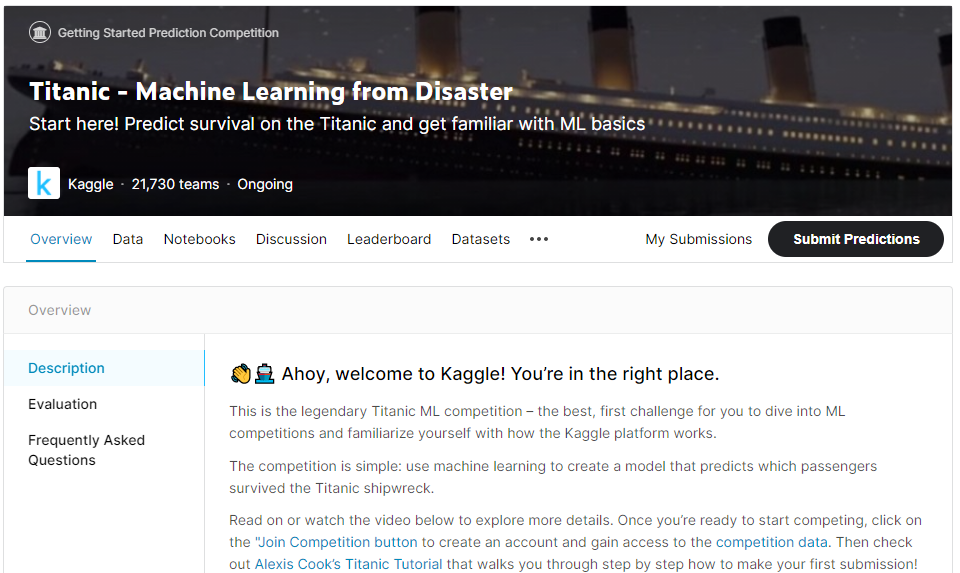

Titanic café
==============================

This is just the Kaggle's Titanic challenge. We'll use this challenge to learn and knowledge about data science and data based projects.

More information about the challenge can be found [here](https://www.kaggle.com/c/titanic).

------------

## Diário de bordo:

>
> **30/01/2021**
> Beginner Kaggle Data Science Project Walk-Through (Titanic)
> https://www.youtube.com/watch?v=I3FBJdiExcg&t=337s
>
> How To EASILY Get Twitter API KEY | Apply For Twitter Developers Account | Download REAL-TIME TWEETS
> https://www.youtube.com/watch?v=vlvtqp44xoQ
>
> Streamlit
> https://www.streamlit.io/
>
> Python : How to Save and Load ML Models
> https://www.kaggle.com/prmohanty/python-how-to-save-and-load-ml-models
>
> Itaú Unibanco: How we built a CI/CD Pipeline for machine learning with online training in Kubeflow
> https://cloud.google.com/blog/products/ai-machine-learning/itau-unibanco-how-we-built-a-cicd-pipeline-for-machine-learning-with-online-training-in-kubeflow
>
> ---
>
> **25/01/2021**
> - Comprehensive Guide on Feature Selection
> https://www.kaggle.com/prashant111/comprehensive-guide-on-feature-selection
>
> ---
>
> **23/01/2021**
> - Data carrers
> https://workera.ai/
>
> - Andrew Ng
> https://medium.com/@aiii/machine-learning-diagnostics-b2256d78d51e
> https://www.youtube.com/watch?v=PPLop4L2eGk&list=PLLssT5z_DsK-h9vYZkQkYNWcItqhlRJLN&ab_channel=ArtificialIntelligence-AllinOne
> 
> - Sobre readme.md
> https://www.aboutmonica.com/blog/how-to-create-a-github-profile-readme
> 
> - Inglês
> http://www.naralschool.com/
> 
> - Machine learning mastery:
> https://machinelearningmastery.com/what-is-imbalanced-classification/
> 
> - Python Pro
> https://www.python.pro.br/
> 
> - Pandas profiling no Google Colab
> https://medium.com/python-in-plain-english/how-to-use-pandas-profiling-on-google-colab-e34f34ff1c9f
>
> - Feature engine
> https://feature-engine.readthedocs.io/en/latest/index.html
>

--------

<small>Project based on the <a target="_blank" href="https://drivendata.github.io/cookiecutter-data-science/">cookiecutter data science project template</a>. #cookiecutterdatascience</small>

